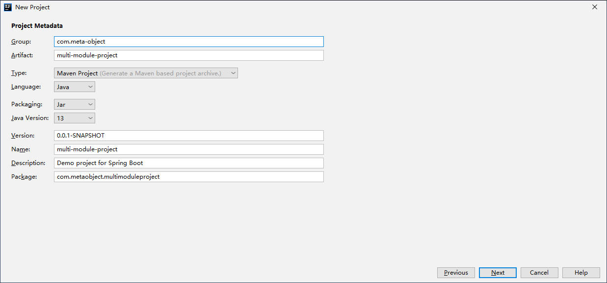
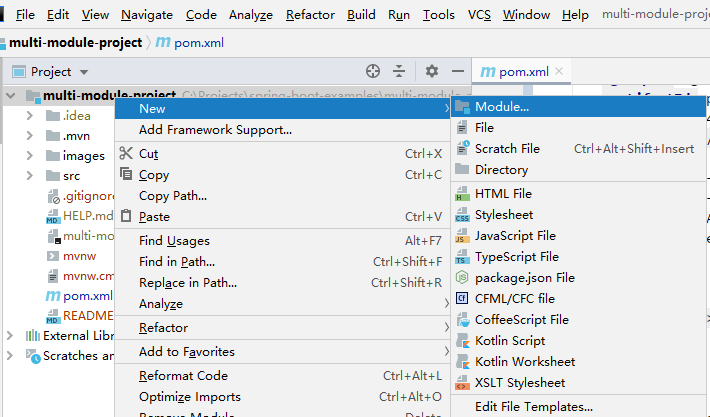
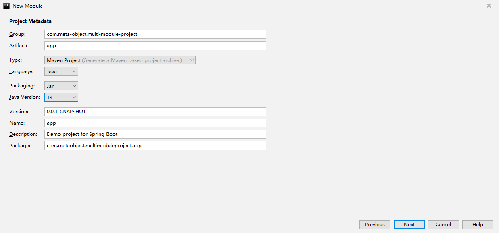

# 多模块 Spring Boot 项目

在开发一个稍具规模的项目时，我们常常希望能够将程序的各个部分分成不同的模块，加以管理。本完简单介绍了如何建立一个多模块的 Spring Boot 项目。

假设我们需要开发一个包含 2 个子模块的项目：`app` 子模块是上层应用，`service` 子模块提供服务。

## 1. 模块配置

使用 `Spring Initializr` 新建一个 Spring Boot 项目。记得选中 `Spring Web` 依赖。



修改 `pom.xml` 文件，将打包模式改为 `pom` 方式，即添加或修改 `<packaging>` tag 为：

```xml
<packaging>pom</packaging>
```

并添加 `<modules>` tag 来指示我们的子模块：

```xml
<modules>
  <module>app</module>
  <module>service</module>
</modules>
```

这个项目主模块是不直接运行的，我们可以删掉 `<build>` tag 和 `src` 文件夹。

在项目管理视图上右击 `multi-module-project` 项目名称，添加 `app` 模块：





使用同样的方式添加另一个名为 `service` 的子模块。

我们得要把项目模块设置为各子模块的父模块，将 `app/pom.xml` 和 `service/pom.xml` 中的 `<parent>` tag 修改为如下内容：

```xml
<parent>
  <groupId>com.meta-object</groupId>
  <artifactId>multi-module-project</artifactId>
  <version>0.0.1-SNAPSHOT</version>
</parent>
```

因为 `service` 子模块只用来给 `app` 提供服务，而不会被直接运行，我们可以把 `service/pom.xml` 中的 `<build>` tag 删掉，并删掉不需要的 `service/src/main/java/com/metaobject/multimoduleproject/service/ServiceApplication.java` 文件。

同时，我们需要修改 `app/pom.xml`，添加对 `service` 模块的依赖：

```xml
<dependency>
  <groupId>com.meta-object.multi-module-project</groupId>
  <artifactId>service</artifactId>
  <version>0.0.1-SNAPSHOT</version>
</dependency>
```

## 2. 功能实现

添加 `service/src/main/java/com/metaobject/multimoduleproject/service/User.java` 文件：

```java
package com.metaobject.multimoduleproject.service;

public class User {

    private String name;

    public String getName() {
        return name;
    }

    public void setName(String name) {
        this.name = name;
    }
}
```

添加 `service/src/main/java/com/metaobject/multimoduleproject/service/UserService.java` 文件：

```java
package com.metaobject.multimoduleproject.service;

import org.springframework.stereotype.Service;

@Service
public class UserService {

    public User getDefaultAdmin() {
        User user = new User();
        user.setName("admin");
        return user;
    }
}
```

这里我们提供了一个最简单的“服务”：查询默认管理员信息。

添加 `app/src/main/java/com/metaobject/multimoduleproject/app/UserController.java` 文件：

```java
package com.metaobject.multimoduleproject.app;

import com.metaobject.multimoduleproject.service.User;
import com.metaobject.multimoduleproject.service.UserService;
import org.springframework.beans.factory.annotation.Autowired;
import org.springframework.web.bind.annotation.GetMapping;
import org.springframework.web.bind.annotation.RestController;

@RestController
public class UserController {

    private UserService userService;

    @Autowired
    public UserController(UserService userService) {
        this.userService = userService;
    }

    @GetMapping("/admin")
    public User showDefaultAdmin() {
        return userService.getDefaultAdmin();
    }
}
```

注意这里 Intellij IDEA 会给出警告：`Could not autowire. No beans of 'UserService' type found.`。

若我们运行 `app` 模块，会得到如下输出：

```
***************************
APPLICATION FAILED TO START
***************************

Description:

Parameter 0 of constructor in com.metaobject.multimoduleproject.app.UserController required a bean of type 'com.metaobject.multimoduleproject.service.UserService' that could not be found.


Action:

Consider defining a bean of type 'com.metaobject.multimoduleproject.service.UserService' in your configuration.
```

这是因为 `app` 模块没扫描到 `UserService` 这个服务。解决方法是在 `app/src/main/java/com/metaobject/multimoduleproject/app/AppApplication.java` 中导入此服务：

```java
package com.metaobject.multimoduleproject.app;

import com.metaobject.multimoduleproject.service.UserService;
import org.springframework.boot.SpringApplication;
import org.springframework.boot.autoconfigure.SpringBootApplication;
import org.springframework.context.annotation.Import;

@SpringBootApplication
@Import(UserService.class)  // 导入 UserService
public class AppApplication {

    public static void main(String[] args) {
        SpringApplication.run(AppApplication.class, args);
    }

}
```

## 3. 试一试！

此时重新运行 `app` 模块并访问 `http://localhost:8080/admin` 可以看到如下结果：


（完）
