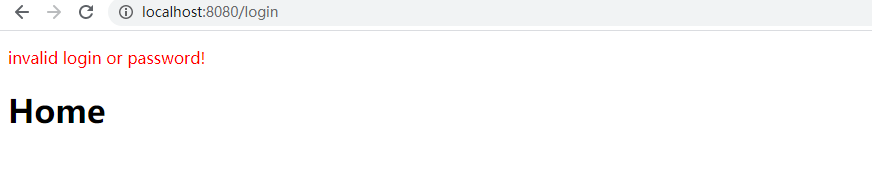

# 集成 Shiro

本文简要说明了在 Spring Boot 应用中如何集成 Apache Shiro，进行简单的用户认证、授权管理等操作。 

在这个应用中，我们假定有三个页面：
* 登录页
* 主页
* 管理页

对应的，有两种用户类型：
* 普通用户
* 管理员

普通用户可以访问主页，但不能访问管理页面；管理员可以访问全部页面。

## 1. 基本的用户登录功能

新建 Spring Boot 项目，添加 Spring Web / Thymeleaf 依赖。

首先，我们需要一个“用户”数据结构来承载登录信息。添加 `src/main/java/com.metaobject.springbootexamples/shiroexample/model/User.java` 文件：

```java
package com.metaobject.springbootexamples.shiroexample.model;

public class User {

    private String login;
    private String password;

    public String getLogin() {
        return login;
    }

    public void setLogin(String login) {
        this.login = login;
    }

    public String getPassword() {
        return password;
    }

    public void setPassword(String password) {
        this.password = password;
    }
}
```
这里只包含了账号/密码，还没有引入用户类型的概念。

然后，我们添加 `src/main/java/com.metaobject.springbootexamples/shiroexample/controller/UserController.java` 来处理请求：

```java
package com.metaobject.springbootexamples.shiroexample.controller;

import com.metaobject.springbootexamples.shiroexample.model.User;
import org.springframework.stereotype.Controller;
import org.springframework.ui.Model;
import org.springframework.web.bind.annotation.GetMapping;
import org.springframework.web.bind.annotation.ModelAttribute;
import org.springframework.web.bind.annotation.PostMapping;

@Controller
public class UserController {
    @GetMapping("/login")
    public String showLoginForm(Model model) {
        // 这里向 model 添加一个空白的 user 对象，用于从 thymeleaf 模板中接收数据。
        model.addAttribute("user", new User());

        // 这里返回的是 thymeleaf 模板文件名称
        return "login";
    }

    @PostMapping("/login")
    public String submitLoginForm(@ModelAttribute User user, Model model) {
        // 为了简便，我们暂时直接在 controller 中模拟用户验证过程。
        if (!user.getLogin().equals("user1") || !user.getPassword().equals("123")) {
            // 若登录失败，我们会给出一个错误信息。
            // 它其实就是个 flash message。
            model.addAttribute("error", "invalid login or password!");
        }

        return "home";
    }
}
```

添加登录页面模板文件 `resources/templates/login.html`：

```html
<!DOCTYPE html>
<html xmlns:th="http://www.thymeleaf.org">
  <body>
    <!-- 这里 th:object 指定的 user，就是上面 controller 中向 model 添加的 user -->
    <form action="#" th:action="@{/login}" th:object="${user}" method="post">
      <label for="login">用户名</label>
      <!-- th:field="*{login}" 指定此 input 的输入会被设置到 user 的 login 属性上 -->
      <input type="text" id="login" th:field="*{login}" />
      <br />

      <label for="password">密码</label>
      <input type="password" id="password" th:field="*{password}" />
      <br />

      <input type="submit" value="登录" />
    </form>
  </body>
</html>
```


添加首页模板文件 `resources/templates/home.html`：

```html
<!DOCTYPE html>
<html xmlns:th="http://www.thymeleaf.org">
<body>
  <!-- 此段落显示错误信息 -->
  <p style="color: red" th:text="${error}"></p>
  <h1>Home</h1>
</body>
</html>
```

启动应用后，访问 `http://localhost:8080/login`，显示登录页面：


用户名/密码分别输入 "user1"/"123" 后点击登录，显示主页：


若输入错误的用户名/密码，则显示错误信息：



## 2. 引入 Apache Shiro

TBC