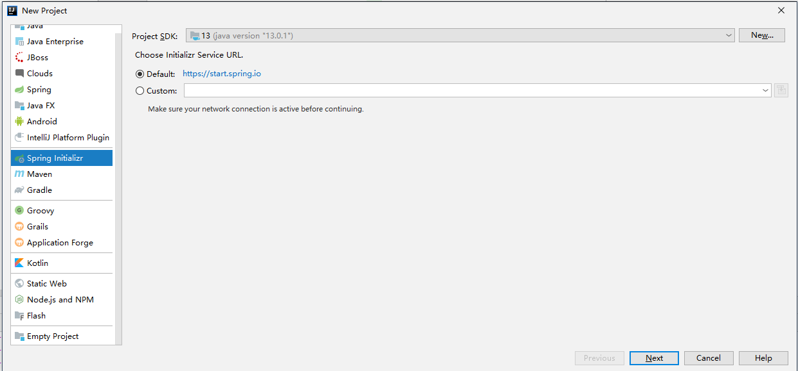
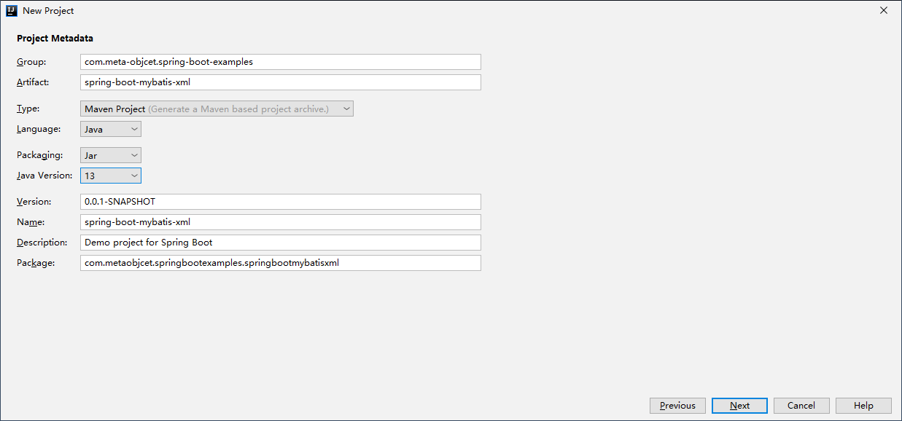
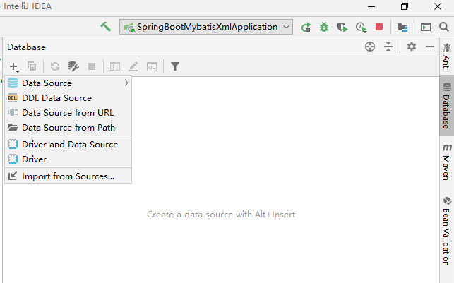
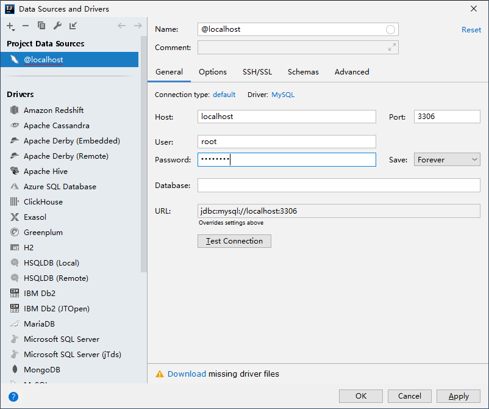
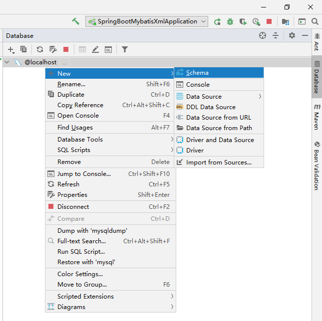
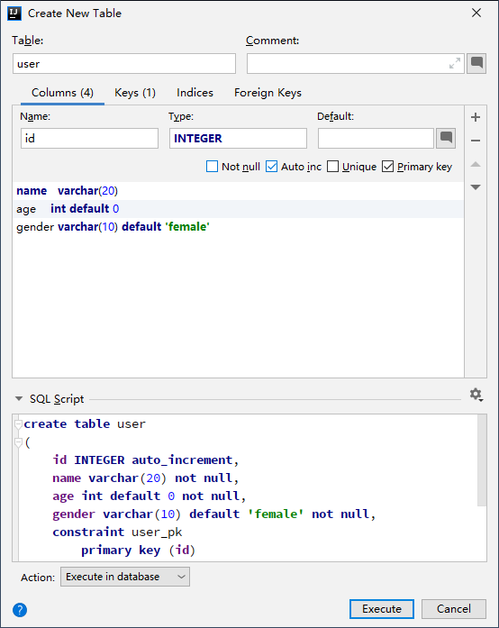
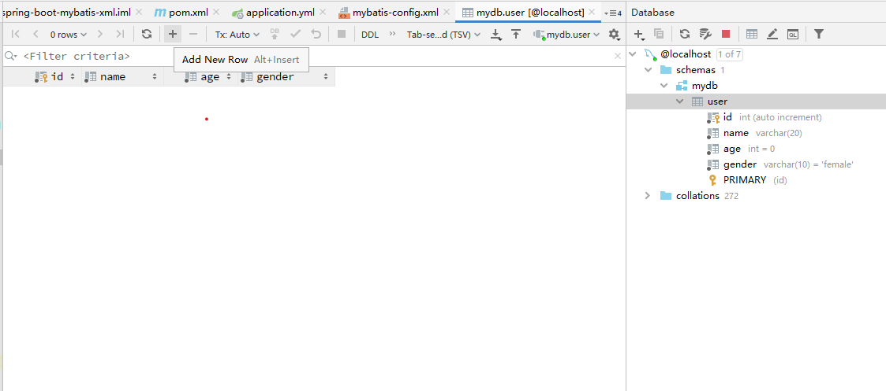
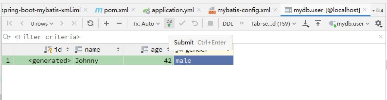

# Spring Boot 集成 Mybatis

本文简单介绍如何在 Spring Boot 中集成 Mybatis，实现对数据库的访问。


## 1. 新建项目

在 Intellij IDEA 中使用 Spring Initializr 新建 Spring Boot 项目。



设置项目的 Group 和 Artifact，并选择 Java 版本。



在依赖中选择 Spring Web 及 Mybatis Framework。对于其他依赖，之后我们会在 `pom.xml` 文件中进行添加。

项目生成后，尝试运行该项目，会得到类似下方的报错信息：

```
***************************
APPLICATION FAILED TO START
***************************

Description:

Failed to configure a DataSource: 'url' attribute is not specified and no embedded datasource could be configured.

Reason: Failed to determine a suitable driver class


Action:

Consider the following:
	If you want an embedded database (H2, HSQL or Derby), please put it on the classpath.
	If you have database settings to be loaded from a particular profile you may need to activate it (no profiles are currently active).
```

这是因为，Mybatis 尝试访问数据库，但没有找到任何数据库相关的设置。

首先，我们将 `src/main/resources/application.propeties` 重命名为 `src/main/resources/application.yml`，并添加如下内容：

```yml
spring:
  datasource:
    url: jdbc:mysql://localhost:3306/mydb
    username: root
    password:
    driver-class-name: com.mysql.cj.jdbc.Driver
```

这里，我们设定 Mybatis 使用 MySQL 作为数据库，并指定了其 Driver 和连接信息。

同时，我们要编辑 `pom.xml` 添加 MySQL Driver 的依赖包，在 `<dependencies>` tag 中添加如下内容：

```xml
<dependency>
    <groupId>mysql</groupId>
    <artifactId>mysql-connector-java</artifactId>
    <scope>runtime</scope>
</dependency>
```

等依赖下载完成后，重新运行该项目，可以正常启动，但日志窗口中会出现类似这样的一条警告：

```
2020-02-17 14:47:43.042  WARN 17016 --- [           main] o.m.s.mapper.ClassPathMapperScanner      : No MyBatis mapper was found in '[com.metaobjcet.springbootexamples.springbootmybatisxml]' package. Please check your configuration.
```

我们暂时不管这个警告。

## 2. 建立数据表

虽然我们可以用命令行或者别的工具来新建数据表，但是这一次我们可以试试 Intellij IDEA 自带的数据库操作工具。



在 `Data Source` 中选择 MySQL，进入如下画面：



先点击 `Download` 来下载 driver files。 然后输入用户名/密码，并确定。在数据库连接上右击，新建名为 `mydb` 的 schema（数据库）。



然后右击 `mydb`，并新建 table，如下图所示：



这样我们的数据表就建立好了。

为了方便后面的测试，我们先插入一条记录。双击 `mydb`，会打开数据编辑窗口：



点击 `+` 号来添加一条记录，会弹出如下窗口：



编辑完成后点击提交按钮，则记录被提交到数据库中。

## 3. 建立数据模型

有了数据表，我们还需要有和数据表对应的数据模型，以便我们在代码中能够方便地访问/操作数据记录。

新建 `src/main/java/com/metaobject/springbootexamples/springbootmybatisxml/model/User.java` 文件：

```java
package com.metaobjcet.springbootexamples.springbootmybatisxml.model;

public class User {

    private Integer id;
    private String name;
    private int age;
    private String gender;

    public Integer getId() {
        return id;
    }

    public void setId(Integer id) {
        this.id = id;
    }

    public String getName() {
        return name;
    }

    public void setName(String name) {
        this.name = name;
    }

    public int getAge() {
        return age;
    }

    public void setAge(int age) {
        this.age = age;
    }

    public String getGender() {
        return gender;
    }

    public void setGender(String gender) {
        this.gender = gender;
    }
}
```

## 4. 建立 ORM 映射

要将此 `User` 与数据库中 `user` table 建立联系，我们还需要 Mapper 对象和 mapper 文件。

新建 `src/main/java/com/metaobject/springbootexamples/springbootmybatisxml/mapper/UserMapper.java` 文件：

```java
package com.metaobjcet.springbootexamples.springbootmybatisxml.mapper;

import com.metaobjcet.springbootexamples.springbootmybatisxml.model.User;
import org.apache.ibatis.annotations.Mapper;

@Mapper
public interface UserMapper {

    User getUserById(Integer id);
}
```

这里新建了一个 Mapper interface，它提供了 `getUserById()` 用于使用 id 来查询一个用户记录。`@Mapper` 注解使得 Mybatis 可以扫描到此 Mapper。

新建 `src/main/resources/mybatis/mybatis-config.xml` 文件，添加如下内容：

```xml
<?xml version="1.0" encoding="UTF-8" ?>
<!DOCTYPE configuration PUBLIC "-//mybatis.org//DTD Config 3.0//EN" "http://mybatis.org/dtd/mybatis-3-config.dtd">
<configuration>
    <typeAliases>
        <typeAlias alias="User" type="com.metaobjcet.springbootexamples.springbootmybatisxml.model.User"/>
    </typeAliases>
</configuration>
```

这里建立 typeAlias 来使得后面的 Mapper xml 文件中可以直接使用 User 类型，而无需写出完整的包路径。

新建 `src/main/resources/mybatis/mapper/UserMapper.xml` 文件，添加如下内容：

```xml
<?xml version="1.0" encoding="UTF-8" ?>
<!DOCTYPE mapper PUBLIC "-//mybatis.org//DTD Mapper 3.0//EN" "http://mybatis.org/dtd/mybatis-3-mapper.dtd" >
<mapper namespace="com.metaobject.springbootmybatisxml.mapper.UserMapper" >
    <select id="getUserById" resultType="User">
        select * from user where id=${id}
    </select>
</mapper>
```

这里我们声明了一个 `getUserById` 接口，并指定其对应的 SQL 语句。

我们还得在 `application.yml` 中添加一些设置，使得 Mybatis 可以找到 config 和 mapper 文件：

```yml
mybatis:
  config-location: classpath:mybatis/mybatis-config.xml
  mapper-locations: classpath:mybatis/mapper/*.xml
  type-aliases-package: com.metaobject.springbootexamples.springbootmybatisxml.model
```

## 5. 试一试！

在完成了上述工作后，我们的数据已经做好被访问的准备了！

新建 `src/main/java/com/metaobject/springbootexamples/springbootmybatisxml/controller/UserController.java` 文件，添加如下内容：

```java
package com.metaobjcet.springbootexamples.springbootmybatisxml.controller;

import com.metaobjcet.springbootexamples.springbootmybatisxml.mapper.UserMapper;
import com.metaobjcet.springbootexamples.springbootmybatisxml.model.User;
import org.springframework.beans.factory.annotation.Autowired;
import org.springframework.web.bind.annotation.GetMapping;
import org.springframework.web.bind.annotation.PathVariable;
import org.springframework.web.bind.annotation.RequestMapping;
import org.springframework.web.bind.annotation.RestController;

@RequestMapping("/user")
@RestController
public class UserController {

    private UserMapper userMapper;

    @Autowired
    public UserController(UserMapper userMapper) {
        this.userMapper = userMapper;
    }
    
    @GetMapping("/{id}")
    public User showUser(@PathVariable("id") Integer id) {
        return userMapper.getUserById(id);
    }
}
```

然后在浏览器中访问 `http://localhost:8080/user/1`，应该得到如下结果：

```
{"id":1,"name":"Johnny","age":42,"gender":"male"}
```

(完)